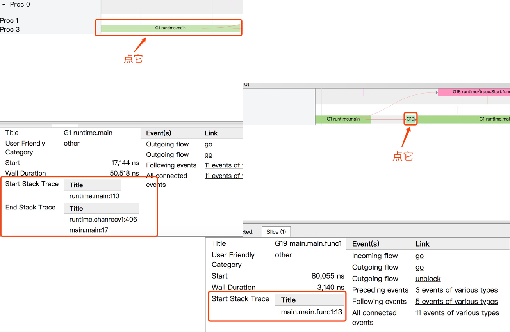

# Go trace
Go PProf 很难完成 Goroutine 的分析。这就需要使用 `go tool trace` 命令。

`go tool pprof` 可以跟踪运行缓慢的函数，或者找到大部分 CPU 时间花费在哪里。
`go tool trace` 更适合于找出程序在一段时间内正在做什么，而不是总体上的开销。

```go
package main

import (    
    "os"
    "runtime/trace"
)

func main() {
	f, err := os.Create("trace.out")
	if err != nil {
		panic(err)
	}
	defer f.Close()

	err = trace.Start(f)
	if err != nil {
		panic(err)
	}
	defer trace.Stop()

    ch := make(chan string)    

    go func() {
        ch <- "hello"
    }()    
    // read from channel
    <-ch

}
```

生成跟踪文件：

```
$ go run main.go
```

启动可视化界面：

```
$ go tool trace trace.out
2019/11/18 15:17:28 Parsing trace...
2019/11/18 15:17:28 Splitting trace...
2019/11/18 15:17:28 Opening browser. Trace viewer is listening on http://127.0.0.1:59181
```

查看可视化界面：

```
View trace
Goroutine analysis
Network blocking profile (⬇)
Synchronization blocking profile (⬇)
Syscall blocking profile (⬇)
Scheduler latency profile (⬇)
User-defined tasks
User-defined regions
Minimum mutator utilization
```

- View trace：最复杂、最强大和交互式的可视化显示了整个程序执行的时间轴。这个视图显示了在每个虚拟处理器上运行着什么，
以及什么是被阻塞等待运行的。
- Goroutine analysis：显示了在整个执行过程中，每种类型的 goroutines 是如何创建的。在选择一种类型之后就可以看到关于这种
类型的 goroutine 的信息。例如，在试图从 mutex 获取锁、从网络读取、运行等等每个 goroutine 被阻塞的时间。
- Network blocking profile：网络阻塞概况
- Synchronization blocking profile：同步阻塞概况
- Syscall blocking profile：系统调用阻塞概况
- Scheduler latency profile：为调度器级别的信息提供计时功能，显示调度在哪里最耗费时间。
- User defined tasks：用户自定义任务
- User defined regions：用户自定义区域
- Minimum mutator utilization：最低 Mutator 利用率

Network/Sync/Syscall blocking profile 是分析锁竞争的最佳选择。

## Scheduler latency profile

查看问题时，除非是很明显的现象，否则先查看 “Scheduler latency profile”，能通过 Graph 看到整体的调用开销情况，如下：


这里只有两块，一个是 `trace` 本身，另外一个是 `channel` 的收发。

## Goroutine analysis

通过 “Goroutine analysis” 这个功能看到整个运行过程中，每个函数块有多少个有 Goroutine 在跑，并且观察每个的 Goroutine 的运行
开销都花费在哪个阶段。如下：


上图有 3 个 goroutine，分别是 `runtime.main`、`runtime/trace.Start.func1`、`main.main.func1`：


同时也可以看到当前 Goroutine 在整个调用耗时中的占比，以及 GC 清扫和 GC 暂停等待的一些开销。可以把图表下载下来分析，相当于把
整个 Goroutine 运行时掰开来看了，这块能够很好的帮助**对 Goroutine 运行阶段做一个的剖析，可以得知到底慢哪，然后再决定
下一步的排查方向**。如下：

| 名称 | 含义 | 耗时
| ---|---|---
| Execution Time | 执行时间 | 3140ns
| Network Wait Time | 网络等待时间 | 0ns
| Sync Block Time | 同步阻塞时间 | 0ns
| Blocking Syscall Time | 调用阻塞时间 | 0ns
| Scheduler Wait Time | 调度等待时间 | 14ns
| GC Sweeping | GC 清扫 | 0ns
| GC Pause | GC 暂停 | 0ns

## View trace


1. 时间线：显示执行的时间单元，根据时间维度的不同可以调整区间，具体可执行 `shift` + `?` 查看帮助手册。
2. 堆：显示执行期间的内存分配和释放情况。
3. 协程：显示在执行期间的每个 Goroutine 运行阶段有多少个协程在运行，其包含 GC 等待（GCWaiting）、可运行（Runnable）、
运行中（Running）这三种状态。
4. OS 线程：显示在执行期间有多少个线程在运行，其包含正在调用 Syscall（InSyscall）、运行中（Running）这两种状态。
5. 虚拟处理器：每个虚拟处理器显示一行，虚拟处理器的数量一般默认为系统内核数。
6. 协程和事件：显示在每个虚拟处理器上有什么 Goroutine 正在运行，而连线行为代表事件关联。


点击具体的 Goroutine 行为后可以看到其相关联的详细信息，这块很简单，大家实际操作一下就懂了。文字解释如下：

- Start：开始时间
- Wall Duration：持续时间
- Self Time：执行时间
- Start Stack Trace：开始时的堆栈信息
- End Stack Trace：结束时的堆栈信息
- Incoming flow：输入流
- Outgoing flow：输出流
- Preceding events：之前的事件
- Following events：之后的事件
- All connected：所有连接的事件

## View Events

可以通过点击 View Options-Flow events、Following events 等方式，查看应用运行中的事件流情况。如下：


通过分析图上的事件流，可得知这程序从 `G1 runtime.main` 开始运行，在运行时创建了 2 个 Goroutine，
先是创建 `G18 runtime/trace.Start.func1`，然后再是 `G19 main.main.func1` 。而同时可以通过其 Goroutine Name 去了解
它的调用类型，如：`runtime/trace.Start.func1` 就是程序中在 `main.main` 调用了 `runtime/trace.Start` 方法，然后该方法又利用
协程创建了一个闭包 `func1` 去进行调用。



结合开头的代码去看的话，很明显就是 `ch` 的输入输出的过程了。

## 收集 trace
1. 使用 `runtime/trace` 包  

调用 `trace.Start` 和 `trace.Stop`。

2. 使用 `-trace=<file>` 测试标志  

用来收集关于被测试代码的 trace 时比较有用。

3 使用 `debug/pprof/trace` handler

用来收集运行中的 web 应用的 trace。

### 跟踪一个 web 应用
如果早已埋好 `_ "net/http/pprof"` 这个工具，就可以执行：
-  curl http://127.0.0.1:6060/debug/pprof/trace\?seconds\=20 > trace.out
-  go tool trace trace.out

#### View trace

点开了 View trace 界面：


在合适的区域执行快捷键 `W` 不断地放大时间线，如下：


初步排查，绝大部分的 G 都和 `google.golang.org/grpc.(*Server).Serve.func` 有关，关联的一大串也是 `Serve` 所触发的相关动作。


继续追踪 View trace 深入进去，“Network blocking profile” 和 “Syscall blocking profile” 所提供的信息，如下：

#### Network blocking profile


#### Syscall blocking profile


通过对以上三项的跟踪分析，加上这个泄露，这个阻塞的耗时，这个涉及的内部方法名，很明显就是忘记关闭客户端连接了。

不建议将 pprof handlers 暴露给 Internet，参考 https://mmcloughlin.com/posts/your-pprof-is-showing。

**内容来自** [Go 大杀器之跟踪剖析 trace](https://github.com/EDDYCJY/blog/blob/7b021d0dee/tools/go-tool-trace.md)